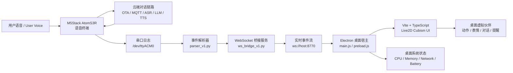
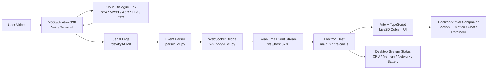

# ENT208TC Assistant

[中文说明](#中文说明) | [English](#english)

## 中文说明

ENT208TC Assistant 是一个面向桌面场景的智能语音伙伴系统。它将 **M5Stack AtomS3R 智能硬件终端**、**Ubuntu 串口事件桥接服务**、**Windows Electron 桌面应用** 和 **Live2D Cubism 虚拟角色界面**组合在一起，让语音交互不只停留在设备端，而是可以实时驱动一个具有状态、表情、动作和对话反馈的桌面虚拟伙伴。

该项目已经形成一套完整的端到端演示链路：用户通过硬件语音终端唤醒和提问，设备完成语音采集与云端对话，串口桥接服务将关键交互事件转换为统一的 WebSocket 消息，桌面应用根据这些消息呈现角色动作、聊天内容、情绪反馈和系统状态。整体体验自然、直观，适合课程展示、产品原型说明、智能硬件交互演示和后续商业化探索。

### 产品定位

ENT208TC Assistant 的核心目标是把“语音助手”从一个单一的问答设备，扩展为一个可被看见、可被感知、可持续陪伴的桌面智能体。

它强调三件事：

- **真实联动**：硬件语音交互、云端对话能力和桌面角色反馈形成实时闭环。
- **可展示性**：桌面端将抽象的语音状态转化为动画、表情、文本和状态提示，展示效果清楚。
- **可扩展性**：系统采用事件协议和模块化结构，后续可以替换模型、扩展角色、接入新后端或加入更多桌面能力。

### 适用场景

- 智能语音硬件课程项目展示
- 桌面虚拟助手或桌宠产品原型
- 端云协同语音系统演示
- Live2D 角色交互实验
- 串口日志到桌面 UI 的实时可视化
- 后续自定义 ASR / LLM / TTS 后端的前端载体

### 产品亮点

#### 1. 端到端语音交互闭环

系统从硬件唤醒、用户语音输入、云端对话回复，到桌面角色反馈形成完整链路。相比单纯展示硬件日志，ENT208TC Assistant 能把每一次语音交互转化为用户能够直接感知的视觉和行为反馈。

#### 2. 桌面虚拟伙伴体验

桌面端基于 Electron、Vite、TypeScript 与 Live2D Cubism 构建，支持角色模型渲染、状态变化、对话气泡、提醒控制、触摸交互和多语言界面。它不是单纯的控制面板，而是一个更接近产品形态的桌面伙伴。

#### 3. 稳定的事件协议

桥接层把串口日志整理为统一 JSON 事件，降低了硬件端、桥接端和桌面端之间的耦合。后续即使更换硬件日志来源或自定义后端，只要保持事件协议一致，桌面端就能继续工作。

#### 4. 面向展示的系统表达

项目把语音状态、网络状态、助手回复、意图、情绪和 TTS 能量转化为更直观的 UI 表达。对非技术观众来说，可以直接看到“设备听到了什么、助手正在做什么、角色为什么有这样的反应”。

#### 5. 可继续演进的技术基础

当前实现已经覆盖硬件联动、桌面应用、角色动画、事件转发和系统状态采样。项目结构清晰，适合在此基础上继续扩展更多角色、更自然的动作、更完整的后端能力和更成熟的部署方式。

### 系统架构



### 工作流程

1. 用户对 M5Stack AtomS3R 语音终端说出唤醒词或问题。
2. 设备完成语音采集，并通过云端链路获得对话回复。
3. 设备运行日志中产生状态变化、用户文本、助手文本和网络事件。
4. Ubuntu 侧桥接服务读取串口日志，并转换为标准 JSON 事件。
5. WebSocket 服务将事件实时推送给 Windows 桌面端。
6. Electron 应用把事件传给 Live2D 前端。
7. 虚拟角色根据事件切换状态、展示文本、触发动作和情绪反馈。

### 核心功能

- 硬件语音终端状态联动
- 串口日志实时解析
- WebSocket 事件广播
- Live2D Cubism 角色渲染
- Idle / Listening / Thinking / Speaking 等状态呈现
- 用户文本与助手回复气泡
- 助手意图、情绪和语音能量推断
- 触摸交互和角色反馈
- 桌面 CPU、内存、网络、电池和窗口焦点采样
- 中英界面与中英项目文档
- 独立 WebSocket 调试客户端

### 技术栈

| 模块 | 技术 | 作用 |
| --- | --- | --- |
| 硬件终端 | M5Stack AtomS3R / ESP32-S3 | 语音采集、播放、唤醒与设备端状态 |
| 固件基础 | xiaozhi-esp32-avatar / ESP-IDF | 提供语音助手端云链路 |
| 桥接服务 | Python / pyserial / websockets | 读取串口日志并推送事件 |
| 桌面宿主 | Electron | 承载桌面窗口、系统状态采样与安全 IPC |
| 前端应用 | Vite / TypeScript | 构建角色界面和交互逻辑 |
| 虚拟角色 | Live2D Cubism | 实现模型、动作、表情和视觉反馈 |
| 调试工具 | Node.js / ws | 验证 WebSocket 事件流 |

### 仓库结构

```text
.
├── bridge/
│   ├── parser_v1.py          # 串口日志到事件协议 v1 的解析器
│   ├── ws_bridge_v1.py       # 串口读取、派生事件、WebSocket 广播
│   ├── serial_live_test.py   # 串口联调辅助脚本
│   ├── start_bridge.sh       # 前台启动桥接服务
│   ├── start_bridge_bg.sh    # 后台启动桥接服务
│   └── requirements.txt      # Python 依赖
├── docs/
│   ├── official-backend-diy.md
│   └── showcase-runbook.md
├── pet_electron/
│   ├── main.js               # Electron 主进程
│   ├── preload.js            # 渲染端安全 API
│   ├── index.html            # 旧版/调试入口
│   ├── cubism_app/           # Vite + TypeScript + Live2D 应用
│   ├── models/               # Live2D 模型资源
│   └── package.json
└── pet_ws/
    ├── ws_client.js          # 最小 WebSocket 调试客户端
    └── package.json
```

### 事件协议 v1

桥接服务会把串口日志转换成结构稳定的 JSON 消息。桌面端只需要理解这些事件，不需要直接解析复杂的硬件日志。

```json
{
  "version": "v1",
  "event": "state_changed",
  "ts": "2026-04-22T12:00:00Z",
  "seq": 1,
  "source": "serial_bridge",
  "payload": {
    "state": "speaking"
  },
  "raw": "I (10809) Application: STATE: speaking",
  "uptime_ms": 10809
}
```

基础事件：

- `wake_detected`：检测到唤醒词
- `state_changed`：设备状态变化
- `user_text`：用户输入文本
- `assistant_text`：助手回复文本
- `network_error`：网络或串口异常提示

派生事件：

- `assistant_intent`：从助手回复推断出的意图
- `assistant_emotion`：适合桌宠表现的情绪标签
- `tts_energy`：语音能量，用于动作强度和嘴型节奏
- `tts_start`：语音播放开始
- `tts_end`：语音播放结束

### 运行环境

- Windows：运行 Electron 桌面端
- Ubuntu / Ubuntu VM：读取 AtomS3R 串口日志
- Python 3.10+
- Node.js 18+
- ESP-IDF v5.4.2
- M5Stack AtomS3R，常见串口为 `/dev/ttyACM0`

### 快速启动

#### 1. Linux / Ubuntu 启动桥接服务

首次运行先安装依赖：

```bash
cd ~/ENT208TC_Assistant/bridge
python3 -m pip install -r requirements.txt
chmod +x start_bridge.sh start_bridge_bg.sh
```

日常启动：

```bash
cd ~/ENT208TC_Assistant/bridge
sudo chmod 666 /dev/ttyACM0
./start_bridge_bg.sh
tail -n 60 bridge.log
```

看到以下内容即表示桥接服务已正常运行：

```text
websocket listening: ws://0.0.0.0:8770
open serial: /dev/ttyACM0 @ 115200
```

如果设备名称不是 `/dev/ttyACM0`，可以先查看：

```bash
ls /dev/ttyACM* /dev/ttyUSB* 2>/dev/null
```

然后指定串口启动：

```bash
./start_bridge.sh /dev/ttyUSB0 115200 0.0.0.0 8770
```

#### 2. Windows 构建并启动桌面端

```powershell
cd pet_electron
npm install
npm run build:cubism_app
npm start
```

也可以直接使用批处理脚本：

```powershell
cd pet_electron
.\start_pet_ui.bat
```

#### 3. 可选：WebSocket 调试客户端

```powershell
cd pet_ws
npm install
$env:WS_URL="ws://192.168.133.140:8770"
node ws_client.js
```

### 展示建议

展示时可以按照以下顺序介绍：

1. 先展示硬件终端完成语音唤醒和对话。
2. 再展示 Ubuntu 桥接服务实时输出事件。
3. 最后展示 Windows 桌面角色如何根据语音状态、用户文本和助手回复产生动作与表情。
4. 重点说明系统不是单个 UI 演示，而是硬件、云端、桥接服务和桌面角色共同组成的端到端产品原型。

### 产品价值总结

ENT208TC Assistant 的价值不只在于实现了语音问答，而在于把语音交互变成了更具表现力的桌面体验。它把硬件设备、云端智能和虚拟角色连接在一起，让用户能够同时听到回复、看到状态、感受到角色反馈。这样的设计让项目在展示时更容易被理解，也为后续扩展成陪伴式助手、学习助手、工作提醒工具或智能硬件控制中心留下了空间。

### 未来增强方向

当前版本已经具备完整的演示和产品原型能力。未来可以继续从以下方向增强：

- **角色表现增强**：增加更多 Live2D 角色、动作组、表情映射和语音节奏动画。
- **对话能力增强**：接入可配置的 LLM、角色人设、长期记忆和个性化回复策略。
- **语音链路增强**：探索自定义 ASR / TTS，优化延迟、音色、成本和可控性。
- **桌面能力扩展**：加入日程提醒、番茄钟、系统通知、快捷操作和应用联动。
- **配置体验优化**：提供可视化设置面板，让用户调整角色、语言、连接地址和提醒偏好。
- **部署体验优化**：打包 Windows 安装程序，提供一键启动脚本和更清晰的演示模式。
- **多设备扩展**：支持更多串口设备、网络设备或多个硬件终端同时接入。
- **数据可视化**：加入交互次数、响应延迟、网络状态和运行日志面板，便于展示与分析。

## English

ENT208TC Assistant is an intelligent desktop voice companion system. It combines a **M5Stack AtomS3R smart voice terminal**, an **Ubuntu serial event bridge**, a **Windows Electron desktop application**, and a **Live2D Cubism virtual character interface**. Together, these modules turn voice interaction into a visible, responsive, and expressive desktop experience.

The project provides a complete end-to-end demonstration flow. A user speaks to the hardware device, the device captures the voice and receives a cloud dialogue response, the bridge service converts key serial logs into normalized WebSocket events, and the desktop application presents character motion, speech bubbles, emotional feedback, and system state. The result is a polished prototype that is easy to demonstrate and easy for non-technical audiences to understand.

### Product Positioning

ENT208TC Assistant expands the idea of a voice assistant from a single question-and-answer device into a visible desktop companion.

It focuses on three goals:

- **Real-time connection**: hardware voice interaction, cloud dialogue, and desktop character feedback work as one loop.
- **Clear demonstration value**: abstract voice states become animations, expressions, messages, and visual feedback.
- **Long-term extensibility**: the event protocol and modular architecture make it possible to replace models, add characters, connect new backends, or expand desktop features.

### Use Cases

- Smart voice hardware coursework demonstration
- Desktop virtual assistant or desktop pet prototype
- End-to-end voice interaction showcase
- Live2D character interaction experiment
- Real-time visualization of hardware serial logs
- Frontend carrier for future custom ASR / LLM / TTS backends

### Product Highlights

#### 1. Complete Voice Interaction Loop

The system connects wake-word detection, user speech, cloud dialogue, serial events, WebSocket streaming, and desktop character feedback. Each interaction can be heard, read, and seen through the virtual companion.

#### 2. Desktop Companion Experience

The desktop side is built with Electron, Vite, TypeScript, and Live2D Cubism. It supports character rendering, state transitions, chat bubbles, reminders, touch interaction, and bilingual interfaces. It is closer to a real product experience than a simple debugging dashboard.

#### 3. Stable Event Protocol

The bridge service converts device logs into structured JSON events. This keeps the hardware layer, bridge layer, and UI layer loosely coupled. Future hardware sources or custom backends can be integrated as long as they follow the same event protocol.

#### 4. Presentation-Friendly Design

The project translates voice states, network states, assistant replies, intent, emotion, and TTS energy into intuitive visual feedback. Non-technical viewers can quickly understand what the system is doing and why the character reacts in a certain way.

#### 5. Strong Foundation for Expansion

The current version already includes hardware integration, desktop rendering, event forwarding, character interaction, and system status sampling. Its structure is ready for future improvements in character design, dialogue intelligence, backend customization, and deployment.

### System Architecture



### How It Works

1. The user speaks to the M5Stack AtomS3R voice terminal.
2. The device captures the voice and receives a cloud dialogue response.
3. The device logs state changes, user text, assistant text, and network events.
4. The Ubuntu bridge reads serial logs and converts them into JSON events.
5. The WebSocket service pushes events to the Windows desktop application.
6. Electron forwards the events to the Live2D frontend.
7. The virtual companion changes state, displays messages, and reacts with motion and emotion.

### Key Features

- Hardware voice terminal integration
- Real-time serial log parsing
- WebSocket event broadcasting
- Live2D Cubism character rendering
- Idle / Listening / Thinking / Speaking state visualization
- User and assistant message bubbles
- Assistant intent, emotion, and speech energy inference
- Touch interaction and character feedback
- Desktop CPU, memory, network, battery, and focus sampling
- Bilingual interface and documentation
- Standalone WebSocket debugging client

### Technology Stack

| Module | Technology | Purpose |
| --- | --- | --- |
| Hardware terminal | M5Stack AtomS3R / ESP32-S3 | Voice capture, playback, wake word, device state |
| Firmware base | xiaozhi-esp32-avatar / ESP-IDF | Voice assistant cloud-device workflow |
| Bridge service | Python / pyserial / websockets | Serial reading and event broadcasting |
| Desktop host | Electron | Desktop window, system sampling, secure IPC |
| Frontend app | Vite / TypeScript | Character UI and interaction logic |
| Virtual character | Live2D Cubism | Model rendering, motions, and expressions |
| Debugging client | Node.js / ws | WebSocket event stream validation |

### Repository Layout

```text
.
├── bridge/
│   ├── parser_v1.py
│   ├── ws_bridge_v1.py
│   ├── serial_live_test.py
│   ├── start_bridge.sh
│   ├── start_bridge_bg.sh
│   └── requirements.txt
├── docs/
│   ├── official-backend-diy.md
│   └── showcase-runbook.md
├── pet_electron/
│   ├── main.js
│   ├── preload.js
│   ├── index.html
│   ├── cubism_app/
│   ├── models/
│   └── package.json
└── pet_ws/
    ├── ws_client.js
    └── package.json
```

### Event Protocol v1

The bridge converts serial output into stable JSON messages. The desktop application consumes these events without needing to parse raw hardware logs directly.

```json
{
  "version": "v1",
  "event": "assistant_text",
  "ts": "2026-04-22T12:00:00Z",
  "seq": 2,
  "source": "serial_bridge",
  "payload": {
    "text": "Hello, I am ready."
  },
  "raw": "I (11000) Application: << Hello, I am ready.",
  "uptime_ms": 11000
}
```

Base events:

- `wake_detected`: wake word detected
- `state_changed`: device state changed
- `user_text`: recognized user text
- `assistant_text`: assistant response text
- `network_error`: network or serial error notification

Derived events:

- `assistant_intent`: inferred intent from the assistant reply
- `assistant_emotion`: emotion label for character presentation
- `tts_energy`: speech energy for motion intensity
- `tts_start`: speech playback started
- `tts_end`: speech playback ended

### Requirements

- Windows for the Electron desktop application
- Ubuntu or Ubuntu VM for serial monitoring
- Python 3.10+
- Node.js 18+
- ESP-IDF v5.4.2
- M5Stack AtomS3R, usually exposed as `/dev/ttyACM0`

### Quick Start

#### 1. Start the Linux / Ubuntu Bridge

Install dependencies for the first run:

```bash
cd ~/ENT208TC_Assistant/bridge
python3 -m pip install -r requirements.txt
chmod +x start_bridge.sh start_bridge_bg.sh
```

Daily startup:

```bash
cd ~/ENT208TC_Assistant/bridge
sudo chmod 666 /dev/ttyACM0
./start_bridge_bg.sh
tail -n 60 bridge.log
```

Successful startup output:

```text
websocket listening: ws://0.0.0.0:8770
open serial: /dev/ttyACM0 @ 115200
```

If the serial device name is different:

```bash
ls /dev/ttyACM* /dev/ttyUSB* 2>/dev/null
```

Then start with the detected port:

```bash
./start_bridge.sh /dev/ttyUSB0 115200 0.0.0.0 8770
```

#### 2. Build and Run the Windows Desktop App

```powershell
cd pet_electron
npm install
npm run build:cubism_app
npm start
```

Or use the startup script:

```powershell
cd pet_electron
.\start_pet_ui.bat
```

#### 3. Optional WebSocket Debugging Client

```powershell
cd pet_ws
npm install
$env:WS_URL="ws://192.168.133.140:8770"
node ws_client.js
```

### Demonstration Flow

For a live presentation, the project can be introduced in this order:

1. Show the hardware terminal handling wake-up and voice dialogue.
2. Show the Ubuntu bridge producing real-time structured events.
3. Show the Windows desktop companion reacting with state changes, messages, motion, and expression.
4. Emphasize that this is not only a UI demo, but an end-to-end system connecting hardware, cloud dialogue, event streaming, and character interaction.

### Product Value

ENT208TC Assistant does more than answer questions. It turns voice interaction into a more expressive desktop experience. Users can hear the reply, read the message, see the state, and feel the character response at the same time. This makes the project easier to understand in a presentation setting and creates a strong foundation for future companion assistants, learning assistants, productivity reminders, or smart hardware control centers.

### Future Enhancements

The current version already works as a complete demonstration and product prototype. Future improvements can include:

- **Richer character presentation**: more Live2D characters, motion groups, expression mapping, and speech-driven animation.
- **Stronger dialogue capability**: configurable LLMs, personas, long-term memory, and personalized response strategies.
- **Improved voice pipeline**: custom ASR / TTS options, lower latency, voice style control, and cost optimization.
- **Desktop feature expansion**: reminders, Pomodoro timer, notifications, quick actions, and app integrations.
- **Better configuration experience**: visual settings for character, language, connection address, and reminder preferences.
- **Deployment improvements**: Windows installer, one-click startup scripts, and a clearer demonstration mode.
- **Multi-device support**: additional serial devices, network devices, or multiple hardware terminals.
- **Operational visualization**: interaction count, response latency, network state, and runtime log dashboards.
