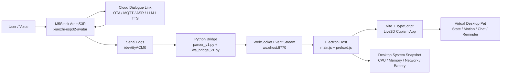

# ENT208TC Assistant

[中文](#中文说明) | [English](#english)

## 中文说明

ENT208TC Assistant 是一个面向课程展示和原型验证的桌面语音助手系统。项目把 **M5Stack AtomS3R / xiaozhi-esp32-avatar** 语音终端、Ubuntu 串口桥接服务、Windows Electron 桌宠界面和 Live2D Cubism 渲染界面连接起来，用于展示“硬件语音交互 + 桌面虚拟伙伴”的实时联动闭环。

当前仓库重点保存桌面联动侧代码：串口日志解析、WebSocket 事件转发、Electron 宿主、Cubism/Vite 前端、Live2D 资源和调试客户端。ESP32 固件工程使用上游 `Gitshaoxiang/xiaozhi-esp32-avatar` 与 ESP-IDF 工具链，本仓库记录其联调流程和事件协议。

### 核心能力

- 从 AtomS3R 串口日志中解析唤醒、状态、用户文本、助手回复和网络异常事件。
- 通过 Python WebSocket 桥接服务把事件广播给 Windows 桌面端。
- 在 Electron 中承载 Vite + TypeScript + Live2D Cubism 界面。
- 根据助手回复推断 intent、emotion 和 TTS energy，驱动桌宠动作、表情和状态反馈。
- 提供桌面系统状态采样，包括 CPU、内存、网络、窗口焦点和 Windows 电池状态。
- 支持本地演示、调试客户端和后续自定义后端扩展。

### 技术系统架构



### 仓库结构

```text
.
├── bridge/
│   ├── parser_v1.py          # 串口日志到事件协议 v1 的解析器
│   ├── ws_bridge_v1.py       # 串口读取、派生事件、WebSocket 广播
│   ├── serial_live_test.py   # 串口联调辅助脚本
│   ├── start_bridge.sh       # 前台启动桥接服务
│   ├── start_bridge_bg.sh    # 后台启动桥接服务
│   └── requirements.txt      # Python 依赖
├── docs/
│   ├── official-backend-diy.md
│   └── showcase-runbook.md
├── pet_electron/
│   ├── main.js               # Electron 主进程和系统状态采样
│   ├── preload.js            # 安全暴露给渲染端的桌面 API
│   ├── index.html            # 旧版/调试界面入口
│   ├── cubism_app/           # Vite + TypeScript + Cubism 前端
│   ├── models/               # Live2D 模型资源
│   └── package.json
└── pet_ws/
    ├── ws_client.js          # 最小 WebSocket 调试客户端
    └── package.json
```

### 事件协议 v1

桥接层把串口日志统一转换为 JSON 事件，供 Electron、调试客户端或后续后端消费。

```json
{
  "version": "v1",
  "event": "state_changed",
  "ts": "2026-04-22T12:00:00Z",
  "seq": 1,
  "source": "serial_bridge",
  "payload": {
    "state": "speaking"
  },
  "raw": "I (10809) Application: STATE: speaking",
  "uptime_ms": 10809
}
```

基础事件包括：

- `wake_detected`
- `state_changed`
- `user_text`
- `assistant_text`
- `network_error`

桥接层还会从助手文本和状态切换中派生更适合桌宠 UI 的事件：

- `assistant_intent`
- `assistant_emotion`
- `tts_energy`
- `tts_start`
- `tts_end`

### 环境要求

- Windows 作为桌面端运行环境。
- Ubuntu 或 Ubuntu VM 用于读取 AtomS3R 串口日志。
- Python 3.10+。
- Node.js 18+。
- Electron。
- ESP-IDF v5.4.2，用于上游 ESP32 固件构建。
- M5Stack AtomS3R，串口通常为 `/dev/ttyACM0`。

### 快速启动

#### 1. 启动 Ubuntu 串口桥接服务

```bash
cd bridge
python -m venv .venv
source .venv/bin/activate
pip install -r requirements.txt
sudo chmod 666 /dev/ttyACM0
python ws_bridge_v1.py --serial /dev/ttyACM0 --baud 115200 --host 0.0.0.0 --port 8770
```

成功标志：

```text
[INFO] websocket listening: ws://0.0.0.0:8770
[INFO] open serial: /dev/ttyACM0 @ 115200
```

#### 2. 构建 Cubism 前端

```powershell
cd pet_electron
npm install
npm run build:cubism_app
```

#### 3. 启动 Electron 桌宠

```powershell
cd pet_electron
npm start
```

#### 4. 可选：运行 WebSocket 调试客户端

```powershell
cd pet_ws
npm install
$env:WS_URL="ws://192.168.133.140:8770"
node ws_client.js
```

### 常见问题

- `/dev/ttyACM0` 不存在：在 VMware 中重新连接 USB 设备，然后执行 `ls /dev/ttyACM*`。
- 串口无权限：执行 `sudo chmod 666 /dev/ttyACM0`。
- WebSocket 端口被占用：检查并结束占用 `8770` 的进程。
- Windows UI 无法连接：确认 Ubuntu VM IP 和端口可达，例如 `Test-NetConnection <vm-ip> -Port 8770`。
- GitHub 提交前不要提交 `node_modules`、`.npm-cache`、`dist`、`__pycache__` 和日志文件。

### 当前阶段

项目已经完成从硬件语音终端到桌面虚拟伙伴的演示级联动框架。下一阶段可以继续增强：

- 更稳定的跨 VM 串口和网络连接恢复。
- 更完整的 Live2D 动作、表情和触摸交互。
- 更可控的自定义 ASR / LLM / TTS 后端。
- 演示脚本、配置面板和部署脚本。

## English

ENT208TC Assistant is a desktop voice-assistant prototype built for coursework demonstration and system integration practice. It connects a **M5Stack AtomS3R / xiaozhi-esp32-avatar** voice terminal, an Ubuntu serial bridge, a Windows Electron host, and a Live2D Cubism desktop pet UI into a real-time interaction loop.

This repository focuses on the desktop integration layer: serial log parsing, WebSocket event forwarding, the Electron shell, the Cubism/Vite frontend, Live2D assets, and debugging clients. The ESP32 firmware is based on the upstream `Gitshaoxiang/xiaozhi-esp32-avatar` project and the ESP-IDF toolchain; this repository documents how the firmware side is connected to the desktop experience.

### Key Features

- Parses AtomS3R serial logs into wake, state, user text, assistant text, and network events.
- Broadcasts normalized events through a Python WebSocket bridge.
- Hosts a Vite + TypeScript + Live2D Cubism UI inside Electron.
- Infers intent, emotion, and TTS energy from assistant replies to drive pet reactions.
- Samples desktop status such as CPU, memory, network, window focus, and Windows battery state.
- Provides a local demo workflow, a debugging client, and a path for custom backend integration.

### System Architecture


### Repository Layout

```text
.
├── bridge/                   # Python serial-to-WebSocket bridge
├── docs/                     # Runbooks and backend notes
├── pet_electron/             # Windows Electron desktop pet host
│   └── cubism_app/           # Vite + TypeScript + Live2D Cubism app
└── pet_ws/                   # Minimal WebSocket debugging client
```

### Event Protocol v1

The bridge converts serial output into stable JSON messages.

```json
{
  "version": "v1",
  "event": "assistant_text",
  "ts": "2026-04-22T12:00:00Z",
  "seq": 2,
  "source": "serial_bridge",
  "payload": {
    "text": "Hello, I am ready."
  },
  "raw": "I (11000) Application: << Hello, I am ready.",
  "uptime_ms": 11000
}
```

Supported base events:

- `wake_detected`
- `state_changed`
- `user_text`
- `assistant_text`
- `network_error`

Derived UI events:

- `assistant_intent`
- `assistant_emotion`
- `tts_energy`
- `tts_start`
- `tts_end`

### Requirements

- Windows for the Electron desktop pet.
- Ubuntu or an Ubuntu VM for serial monitoring.
- Python 3.10+.
- Node.js 18+.
- Electron.
- ESP-IDF v5.4.2 for the upstream ESP32 firmware.
- M5Stack AtomS3R, usually exposed as `/dev/ttyACM0`.

### Quick Start

Start the bridge:

```bash
cd bridge
python -m venv .venv
source .venv/bin/activate
pip install -r requirements.txt
sudo chmod 666 /dev/ttyACM0
python ws_bridge_v1.py --serial /dev/ttyACM0 --baud 115200 --host 0.0.0.0 --port 8770
```

Build the Cubism UI:

```powershell
cd pet_electron
npm install
npm run build:cubism_app
```

Run the Electron desktop app:

```powershell
cd pet_electron
npm start
```

Optional WebSocket debugging client:

```powershell
cd pet_ws
npm install
$env:WS_URL="ws://192.168.133.140:8770"
node ws_client.js
```

### Roadmap

- Improve serial and network recovery across the Ubuntu VM and Windows host.
- Expand Live2D motion, expression, and touch interaction coverage.
- Add a configurable custom ASR / LLM / TTS backend.
- Package the demo workflow with clearer scripts and deployment notes.
